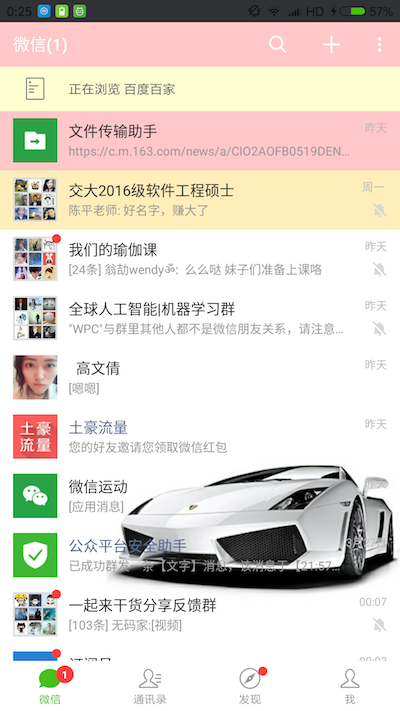

This is an android application to change wechat theme.
Technique included in this are more than below.

本项目所使用到的技术包括但不限于:

1. 使用kotlin语言进行开发android
2. 基于xposed框架进行模块开发
3. 嵌入react-native页面
4. 使用annotation在编译期间自动生成所有新的配置
5. 不便公开的细节和接口实现均隐藏在JNI中

